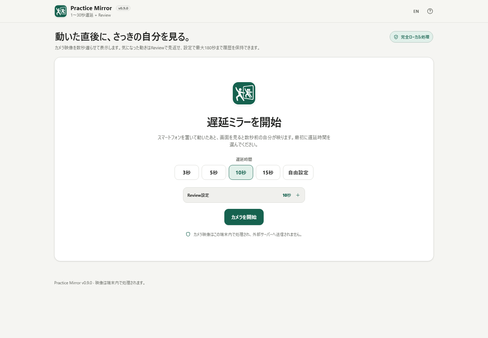

# Practice Mirror

[English README](README.md)

スポーツ・ダンス・トレーニングなどの自主練で、カメラ映像を数秒遅らせて表示する練習ミラーです。動き終わって画面を見ると、ちょうどさっきの自分を確認できます。

## スクリーンショット

スマートフォン版: [assets/screenshot-mobile.png](assets/screenshot-mobile.png)

## 主な機能

- **遅延ミラー** — 3 / 5 / 10 / 15秒、または1〜30秒の自由設定。
- **Review履歴を10〜180秒で設定** — デフォルトは10秒。約10秒たまればReviewを使え、その後は設定した上限まで履歴を保持します。
- **細かく見返す** — 0.25× / 0.5× / 1× / 2×、シーク、1コマ戻る/進む。
- **Reviewを1つの操作ブロックへ整理** — 再生・速度・シーク・練習に戻る・終了をまとめ、保存設定は必要な時だけ展開。
- **縦横ガイド** — ドラッグとキーボード操作に対応。
- **左右反転** — 表示だけを反転し、圧縮映像自体は変更しません。
- **シーク可能なローカル保存** — ReviewクリップをWebMで保存し、ダウンロード前にduration metadataを端末内で補正します。
- **Practice向けUI** — カメラ切替、全画面、Screen Wake Lock、スマホauto-hide、横向きレイアウト。
- **スマホの操作パネル** — ガイド/左右反転/カメラ切替/全画面などは初期状態で閉じ、「操作」から展開。
- **Adaptive / Reliability** — 継続負荷時の品質調整、bounded buffer、カメラ/codec異常の限定復旧。
- **日本語 / English** — 同じ単一HTML内で切り替え。
- **ローカル処理** — カメラ映像、Review、ガイド、性能/Reliability情報はブラウザ内で扱います。

## 使い方

1. 遅延秒数を選びます。
2. **カメラを開始** を押し、カメラ利用を許可します。
3. Warm-upを待ちます。
4. 遅延映像を見ながら練習します。10秒より長く残したい場合は開始前に **Review設定** で上限を10〜180秒から指定します。
5. 約10秒たまると **Review** を使え、その後は設定した上限まで履歴が伸びます。
6. スロー/倍速再生、シーク、コマ送りで確認します。
7. 残したい場合だけ **クリップ保存** を開いて保存します。
8. **練習に戻る** で遅延バッファを作り直します。
9. 終わったら **終了** を押します。

## プライバシー

単一HTML版はカメラ映像を外部サーバーへアップロードせず、マイク音声も要求しません。

- CSPは `connect-src 'none'`。
- 外部runtime script/style/fontなし。
- アプリ独自のAnalytics / telemetryなし。
- 動画の自動永続保存なし。
- `fix-webm-duration` 1.0.6は単一HTMLへ内包し、Review保存時だけ埋め込みassetから読み込みます。
- 一時Blob URLは端末内だけで使用し、後で解放します。

## 対応ブラウザ条件

コア機能には安全なカメラ利用環境と `getUserMedia()`、`requestVideoFrameCallback()`、`VideoFrame`、`VideoEncoder`、`VideoDecoder`、WebCodecsのH.264またはVP8対応が必要です。

Fullscreen、Screen Wake Lock、複数カメラ、Canvas `captureStream()`、`MediaRecorder` は任意機能です。

Review保存にはブラウザのWebM MediaRecorder対応も必要です。seekable WebMを作れない環境ではReview自体は利用でき、保存だけ無効になります。

## 単一HTML

ビルドすると以下を生成します。

- `dist/index.html`
- `practice-mirror.html`
- `dist/index.self-extract.html`

リポジトリ直下の `practice-mirror.html` は読みやすいstandalone buildと同一内容です。必要なruntime dependencyはHTML内に埋め込み、CDNは利用しません。

## v0.9.0 Release Candidate

機能追加を止め、公開前の最終確認を行います。スマートフォン/PC、日本語/English、Review操作性、保存、カメラライフサイクル、アクセシビリティ、長時間利用、単一HTML、CSP/外部通信、README、favicon、スクリーンショットを確認します。

確認項目:

- [RELEASE_CHECKLIST.md](RELEASE_CHECKLIST.md)
- [MOBILE_ACCESSIBILITY_TEST_MATRIX.md](MOBILE_ACCESSIBILITY_TEST_MATRIX.md)
- [RELIABILITY_TEST_MATRIX.md](RELIABILITY_TEST_MATRIX.md)

## 制限

- 遅延ミラー本体にはWebCodecs対応が必要です。
- v0.9.0のReview保存は、シーク可能性を優先してWebMのみです。
- カメラ、Wake Lock、Fullscreen、background動作にはブラウザ/OS差があります。
- Review履歴を長くすると端末メモリ使用量が増えます。180秒では、処理品質によって圧縮映像だけでも数十MB規模になる場合があります。
- 長いReviewの保存はブラウザ内で実時間に近い形で再構成するため、クリップ時間と同程度かかる場合があります。
- 長時間利用やカメラ切替はCPU/バッテリーを使用します。
- 音声録音とAI姿勢推定は意図的に含めていません。

## Dependencies

| ライブラリ | バージョン | ライセンス | 用途 |
| --- | ---: | --- | --- |
| fix-webm-duration | 1.0.6 | MIT | MediaRecorderのWebMへduration情報を補い、保存したReviewをシーク可能にする |

## Development

    powershell.exe -NoLogo -NoProfile -ExecutionPolicy Bypass -File .\scripts\check-powershell-syntax.ps1
    powershell.exe -NoLogo -NoProfile -ExecutionPolicy Bypass -File .\scripts\check-repository.ps1

## License

Copyright © 2026 ttomohisa

[MIT License](LICENSE)
