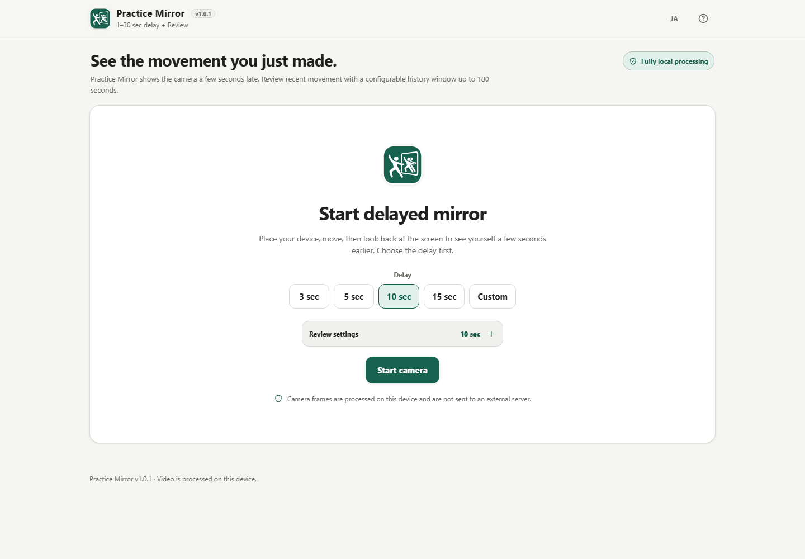

# Practice Mirror

[日本語版 README](README.ja.md)

A privacy-focused delayed camera mirror for sports, dance, training, and other self-practice. Practice Mirror shows the camera a few seconds late so you can finish a movement, look back at the screen, and immediately see what you actually did.

## Screenshot

Mobile screenshot: [assets/screenshot-mobile-en.png](assets/screenshot-mobile-en.png)

## Features

- **Delayed mirror** — 3 / 5 / 10 / 15 second presets or a custom 1–30 second delay.
- **Previous-10-second Review** — Freeze the movement you just made without a normal record/stop workflow.
- **Detailed inspection** — 0.25x / 0.5x / 1x / 2x playback, seeking, and frame stepping.
- **Compact Review dock** — Playback, speed, seek, Back to practice, and Stop are grouped together; Save clip stays collapsed until needed.
- **Alignment guides** — Add draggable vertical/horizontal guides; keyboard users can move them with Arrow keys.
- **Mirror display** — Flip the displayed image without modifying encoded media.
- **Seekable local save** — Save the frozen Review clip as WebM. Duration metadata is repaired locally before download so normal video players can seek.
- **Practice UX** — Camera switching, Fullscreen, optional Screen Wake Lock, mobile auto-hide, and short-landscape layout.
- **Mobile controls panel** — Guide/mirror/camera/fullscreen controls start collapsed on smartphones.
- **Adaptive / reliable processing** — Sustained load can reduce processing quality, buffers remain bounded, and limited recovery handles recoverable camera/codec failures.
- **Japanese / English UI** — Both languages are included in the same standalone HTML.
- **Local processing** — Camera frames, Review media, guides, performance counters, and reliability state stay in the browser.

## Usage

1. Choose the delay.
2. Select **Start camera** and allow camera access.
3. Wait for Warm-up.
4. Practice while the screen shows the selected delay.
5. Select **Review** after enough history is available.
6. Inspect the frozen clip with slow/fast playback, seek, or frame stepping.
7. Open **Save clip** only if you want to keep it.
8. Select **Back to practice** to rebuild the delayed buffer.
9. Select **Stop** when finished.

## Privacy

The standalone app does not upload camera video and does not request microphone audio.

- CSP contains `connect-src 'none'`.
- No external runtime scripts, styles, or fonts are loaded.
- No application analytics or telemetry are sent.
- Media is not persisted automatically.
- `fix-webm-duration` 1.0.6 is embedded in the standalone HTML and is loaded from the embedded asset bundle only when a Review clip is saved.
- Temporary Blob URLs are local and revoked after use.

## Browser requirements

Core delayed Practice requires a secure camera context plus `getUserMedia()`, `requestVideoFrameCallback()`, `VideoFrame`, `VideoEncoder`, `VideoDecoder`, and a supported H.264 or VP8 WebCodecs pair.

Optional capabilities include Fullscreen, Screen Wake Lock, multiple video inputs, Canvas `captureStream()`, and `MediaRecorder`.

Review saving additionally requires a WebM MediaRecorder format supported by the browser. If seekable WebM export is unavailable, Review remains usable and Save is disabled.

## Standalone build

The build generates:

- `dist/index.html`
- `practice-mirror.html`
- `dist/index.self-extract.html`

`practice-mirror.html` is byte-identical to the readable standalone build. Runtime dependencies are embedded; the app does not load a CDN.

## v0.9.0 Release Candidate

Feature work is frozen. The release candidate focuses on packaging, screenshots, Japanese/English UI, CSP/runtime networking, camera/save error states, mobile/accessibility, Review ergonomics, and long-session reliability.

Release gates:

- [RELEASE_CHECKLIST.md](RELEASE_CHECKLIST.md)
- [MOBILE_ACCESSIBILITY_TEST_MATRIX.md](MOBILE_ACCESSIBILITY_TEST_MATRIX.md)
- [RELIABILITY_TEST_MATRIX.md](RELIABILITY_TEST_MATRIX.md)

## Limitations

- Core delayed playback requires WebCodecs support.
- Review export is WebM-only in v0.9.0 so the app can repair duration metadata and prioritize seekable files.
- Camera, Wake Lock, Fullscreen, and background behavior differ by browser/OS.
- Long sessions and camera switching consume CPU/battery.
- Audio recording and AI pose estimation are intentionally not included.

## Dependencies

| Library | Version | License | Purpose |
| --- | ---: | --- | --- |
| fix-webm-duration | 1.0.6 | MIT | Repairs WebM duration metadata after MediaRecorder export so saved Review clips can be seeked |

## Development

Run the template checks before completion:

    powershell.exe -NoLogo -NoProfile -ExecutionPolicy Bypass -File .\scripts\check-powershell-syntax.ps1
    powershell.exe -NoLogo -NoProfile -ExecutionPolicy Bypass -File .\scripts\check-repository.ps1

## License

Copyright © 2026 ttomohisa

Licensed under the [MIT License](LICENSE).
